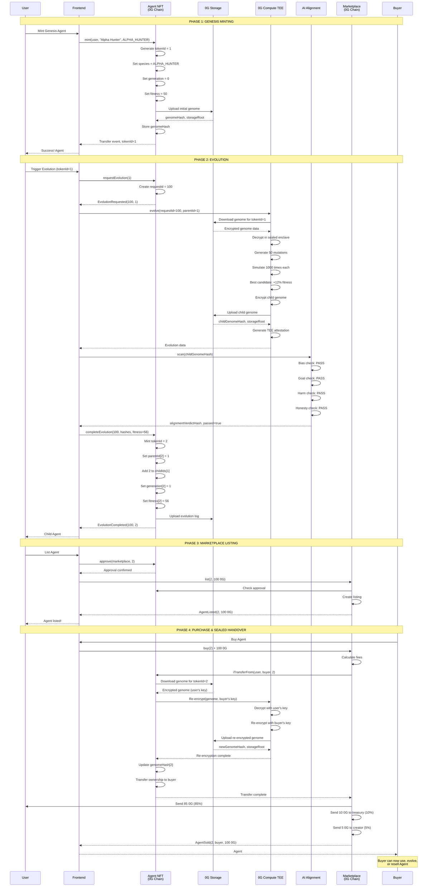

# 🏗️ REPLICANT Architecture - Additional Diagrams (Part 2)

## 8. 0G Storage Integration Details

```mermaid
graph TB
    subgraph "Application Layer"
        Frontend[Next.js Frontend]
        API[API Routes]
    end

    subgraph "0G Storage SDK"
        Indexer[0G Storage Indexer]
        Client[0G Storage Client]
        Flow[0G Storage Flow]
    end

    subgraph "0G Storage Network"
        subgraph "Storage Log - Permanent Archive"
            LogNode1[Log Node 1]
            LogNode2[Log Node 2]
            LogNode3[Log Node 3]
            
            GenomeBlob[Genome Blobs<br/>Encrypted with AES-256]
            EvolutionBlob[Evolution History Blobs]
            AttestationBlob[TEE Attestation Blobs]
            VerdictBlob[Alignment Verdict Blobs]
        end
        
        subgraph "Storage KV - Real-Time Cache"
            KVNode1[KV Node 1]
            KVNode2[KV Node 2]
            KVNode3[KV Node 3]
            
            MetricsKV[Agent Metrics<br/>Key: agentId]
            SignalsKV[Trading Signals<br/>Key: agentId:timestamp]
            PerformanceKV[Performance Stats<br/>Key: agentId:metric]
            MemoryKV[Working Memory<br/>Key: agentId:session]
        end
    end

    subgraph "Storage Operations"
        Upload[Upload Operation]
        Download[Download Operation]
        Verify[Merkle Proof Verification]
    end

    Frontend --> API
    API --> Indexer
    API --> Client
    API --> Flow
    
    Indexer --> LogNode1
    Client --> LogNode2
    Flow --> LogNode3
    
    Upload --> GenomeBlob
    Upload --> EvolutionBlob
    Upload --> AttestationBlob
    Upload --> VerdictBlob
    
    Download --> GenomeBlob
    Download --> EvolutionBlob
    
    Verify --> GenomeBlob
    
    API --> KVNode1
    API --> KVNode2
    API --> KVNode3
    
    KVNode1 --> MetricsKV
    KVNode2 --> SignalsKV
    KVNode3 --> PerformanceKV
    KVNode3 --> MemoryKV

    style LogNode1 fill:#8b5cf6,stroke:#fff,color:#fff
    style LogNode2 fill:#8b5cf6,stroke:#fff,color:#fff
    style LogNode3 fill:#8b5cf6,stroke:#fff,color:#fff
    style KVNode1 fill:#8b5cf6,stroke:#fff,color:#fff
    style KVNode2 fill:#8b5cf6,stroke:#fff,color:#fff
    style KVNode3 fill:#8b5cf6,stroke:#fff,color:#fff
```

---

## 9. 0G Compute TEE Workflow

```mermaid
graph TB
    subgraph "Evolution Request"
        User[User Triggers Evolution]
        Contract[Evolution Coordinator]
    end

    subgraph "0G Compute TEE Enclave"
        subgraph "Secure Boot"
            Attestation[Generate Attestation]
            Verify[Verify Enclave Integrity]
        end
        
        subgraph "Genome Processing"
            Download[Download Encrypted Genome<br/>from 0G Storage]
            Decrypt[Decrypt with Parent Key<br/>Inside TEE]
            Validate[Validate Genome Structure]
        end
        
        subgraph "Mutation Engine"
            Strategy[Select Mutation Strategy<br/>Gaussian/Uniform/Crossover]
            Generate[Generate 50 Candidates]
            Mutate[Apply Mutations<br/>Weight adjustments]
        end
        
        subgraph "Fitness Evaluation"
            Simulate[Run 1000 Simulations<br/>per Candidate]
            Score[Calculate Fitness Scores]
            Rank[Rank by Performance]
            Select[Select Best Candidate]
        end
        
        subgraph "Child Preparation"
            Encrypt[Encrypt Child Genome<br/>with Child Key]
            Hash[Generate Genome Hash<br/>keccak256]
            Sign[Sign with TEE Key]
        end
        
        subgraph "Storage Upload"
            Upload[Upload to 0G Storage]
            GetRoot[Get Storage Root Hash]
            Commit[Commit to Blockchain]
        end
    end

    subgraph "Alignment Verification"
        AlignmentNode[AI Alignment Node]
        SafetyChecks[Run Safety Checks]
        VerdictHash[Generate Verdict Hash]
    end

    subgraph "On-Chain Completion"
        Complete[Complete Evolution]
        Mint[Mint Child NFT]
        UpdateLineage[Update Family Tree]
    end

    User --> Contract
    Contract --> Attestation
    Attestation --> Verify
    Verify --> Download
    Download --> Decrypt
    Decrypt --> Validate
    Validate --> Strategy
    Strategy --> Generate
    Generate --> Mutate
    Mutate --> Simulate
    Simulate --> Score
    Score --> Rank
    Rank --> Select
    Select --> Encrypt
    Encrypt --> Hash
    Hash --> Sign
    Sign --> Upload
    Upload --> GetRoot
    GetRoot --> AlignmentNode
    AlignmentNode --> SafetyChecks
    SafetyChecks --> VerdictHash
    VerdictHash --> Commit
    Commit --> Complete
    Complete --> Mint
    Mint --> UpdateLineage

    style Attestation fill:#8b5cf6,stroke:#fff,color:#fff
    style Decrypt fill:#8b5cf6,stroke:#fff,color:#fff
    style Encrypt fill:#8b5cf6,stroke:#fff,color:#fff
    style Upload fill:#8b5cf6,stroke:#fff,color:#fff
```

---

## 10. Complete Data Flow - Genesis to Evolution to Marketplace

