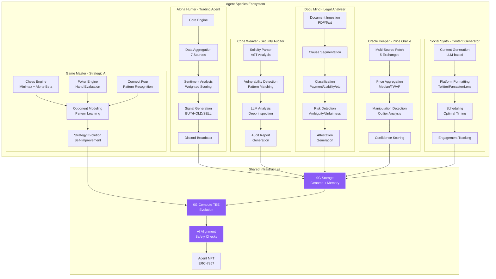
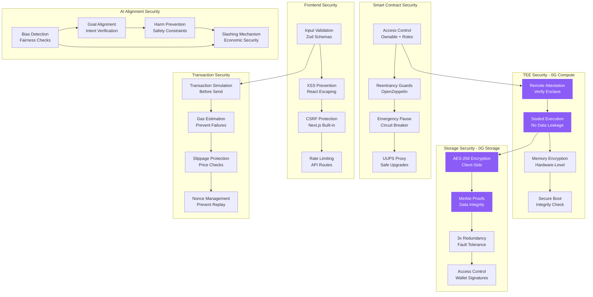
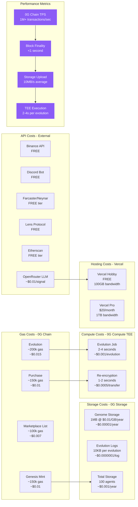
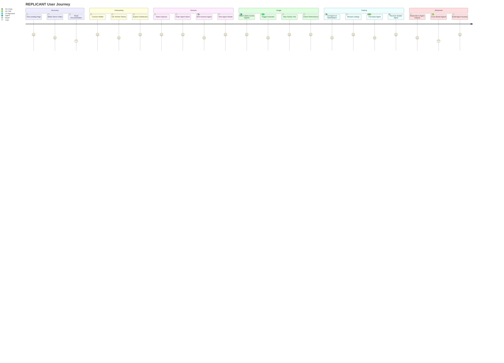

# 🏗️ REPLICANT Architecture - Additional Diagrams (Part 3)

## 11. Six Agent Species Architecture

---

## 12. Technology Stack Deep Dive

```mermaid
graph TB
    subgraph "Frontend Stack"
        Next[Next.js 15<br/>App Router]
        React[React 19<br/>Server Components]
        TS[TypeScript 5.3<br/>Type Safety]
        Tailwind[Tailwind CSS<br/>Utility-First]
        Shadcn[shadcn/ui<br/>Radix Primitives]
        
        Next --> React
        React --> TS
        TS --> Tailwind
        Tailwind --> Shadcn
    end

    subgraph "Web3 Stack"
        Wagmi[wagmi v2<br/>React Hooks]
        Viem[viem<br/>TypeScript Client]
        WC[WalletConnect<br/>Multi-Wallet]
        RainbowKit[RainbowKit<br/>UI Components]
        
        Wagmi --> Viem
        Viem --> WC
        WC --> RainbowKit
    end

    subgraph "Smart Contract Stack"
        Solidity[Solidity 0.8.20<br/>Smart Contracts]
        Foundry[Foundry<br/>Build & Test]
        OZ[OpenZeppelin<br/>Standards]
        Upgradeable[UUPS Proxy<br/>Upgradeability]
        
        Solidity --> Foundry
        Foundry --> OZ
        OZ --> Upgradeable
    end

    subgraph "0G Stack"
        ZGChain[0G Chain<br/>Galileo Testnet]
        ZGStorage[0G Storage<br/>Log + KV]
        ZGCompute[0G Compute<br/>TEE Network]
        ZGSDK[0G SDK<br/>TypeScript]
        
        ZGChain --> ZGSDK
        ZGStorage --> ZGSDK
        ZGCompute --> ZGSDK
    end

    subgraph "Backend Stack"
        NextAPI[Next.js API Routes<br/>Serverless]
        NodeRuntime[Node.js 20<br/>Runtime]
        Vercel[Vercel<br/>Deployment]
        Cron[Vercel Cron<br/>Scheduled Jobs]
        
        NextAPI --> NodeRuntime
        NodeRuntime --> Vercel
        Vercel --> Cron
    end

    subgraph "External APIs"
        Binance[Binance API<br/>Price Data]
        Discord[Discord.js<br/>Bot Integration]
        Neynar[Neynar API<br/>Farcaster]
        LensAPI[Lens Protocol<br/>GraphQL]
        Etherscan[Etherscan API<br/>Whale Tracking]
        OpenRouter[OpenRouter<br/>LLM Gateway]
        
        Binance --> NextAPI
        Discord --> NextAPI
        Neynar --> NextAPI
        LensAPI --> NextAPI
        Etherscan --> NextAPI
        OpenRouter --> NextAPI
    end

    subgraph "State Management"
        Zustand[Zustand<br/>Global State]
        ReactQuery[TanStack Query<br/>Server State]
        ReactHookForm[React Hook Form<br/>Form State]
        Zod[Zod<br/>Validation]
        
        Zustand --> React
        ReactQuery --> React
        ReactHookForm --> Zod
    end

    Next --> Wagmi
    Wagmi --> ZGSDK
    ZGSDK --> ZGChain
    ZGSDK --> ZGStorage
    ZGSDK --> ZGCompute
    
    Solidity --> ZGChain
    
    NextAPI --> ZGSDK

    style ZGChain fill:#8b5cf6,stroke:#fff,color:#fff
    style ZGStorage fill:#8b5cf6,stroke:#fff,color:#fff
    style ZGCompute fill:#8b5cf6,stroke:#fff,color:#fff
    style ZGSDK fill:#8b5cf6,stroke:#fff,color:#fff
```

---

## 13. Security Architecture

---

## 14. Deployment Architecture

```mermaid
graph TB
    subgraph "Production Environment"
        subgraph "Vercel Edge Network"
            Edge1[Edge Node - US East]
            Edge2[Edge Node - EU West]
            Edge3[Edge Node - Asia Pacific]
            CDN[Vercel CDN<br/>Static Assets]
        end
        
        subgraph "Serverless Functions"
            API1[API Route - Storage]
            API2[API Route - Compute]
            API3[API Route - AlphaHunter]
            API4[API Route - Cron]
        end
        
        subgraph "Cron Jobs"
            CronAlpha[AlphaHunter Cron<br/>Every Hour]
            CronMetrics[Metrics Update<br/>Every 5 Minutes]
        end
    end

    subgraph "0G Network - Galileo Testnet"
        subgraph "Blockchain Layer"
            Validator1[Validator Node 1]
            Validator2[Validator Node 2]
            Validator3[Validator Node 3]
            RPC[RPC Endpoint<br/>https://rpc-testnet.0g.ai]
        end
        
        subgraph "Smart Contracts"
            AgentNFT[ReplicantAgentNFT<br/>0x026a3279...]
            Evolution[EvolutionCoordinator<br/>0x61792dC3...]
            Market[Marketplace<br/>0x15dB35f1...]
            Escrow[SubscriptionEscrow<br/>0x63eeF8C1...]
        end
    end

    subgraph "0G Storage Network"
        StorageNode1[Storage Node 1<br/>US Region]
        StorageNode2[Storage Node 2<br/>EU Region]
        StorageNode3[Storage Node 3<br/>Asia Region]
        Indexer[Storage Indexer<br/>Query Interface]
    end

    subgraph "0G Compute Network"
        TEENode1[TEE Node 1<br/>Intel SGX]
        TEENode2[TEE Node 2<br/>AMD SEV]
        TEENode3[TEE Node 3<br/>ARM TrustZone]
        Orchestrator[Compute Orchestrator<br/>Job Scheduler]
    end

    subgraph "External Services"
        Discord[Discord Bot<br/>Signal Broadcast]
        OpenRouter[OpenRouter<br/>LLM Gateway]
        Binance[Binance API<br/>Price Data]
    end

    Edge1 --> API1
    Edge2 --> API2
    Edge3 --> API3
    
    API1 --> RPC
    API2 --> RPC
    API3 --> RPC
    API4 --> RPC
    
    RPC --> Validator1
    RPC --> Validator2
    RPC --> Validator3
    
    Validator1 --> AgentNFT
    Validator2 --> Evolution
    Validator3 --> Market
    
    API1 --> StorageNode1
    API1 --> StorageNode2
    API1 --> StorageNode3
    StorageNode1 --> Indexer
    
    API2 --> Orchestrator
    Orchestrator --> TEENode1
    Orchestrator --> TEENode2
    Orchestrator --> TEENode3
    
    CronAlpha --> API3
    CronMetrics --> API4
    
    API3 --> Discord
    API3 --> OpenRouter
    API3 --> Binance

    style RPC fill:#8b5cf6,stroke:#fff,color:#fff
    style StorageNode1 fill:#8b5cf6,stroke:#fff,color:#fff
    style StorageNode2 fill:#8b5cf6,stroke:#fff,color:#fff
    style StorageNode3 fill:#8b5cf6,stroke:#fff,color:#fff
    style TEENode1 fill:#8b5cf6,stroke:#fff,color:#fff
    style TEENode2 fill:#8b5cf6,stroke:#fff,color:#fff
    style TEENode3 fill:#8b5cf6,stroke:#fff,color:#fff
```

---

## 15. Cost & Performance Metrics

---

## 16. User Journey Map

