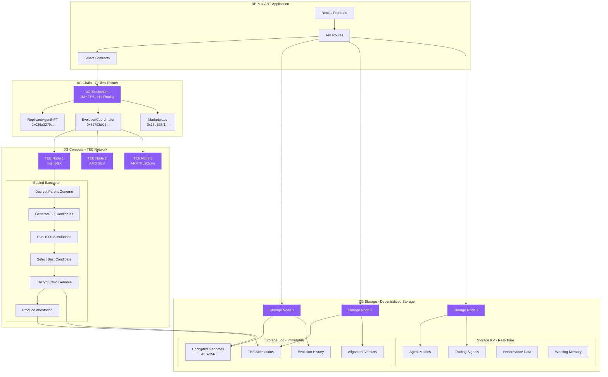
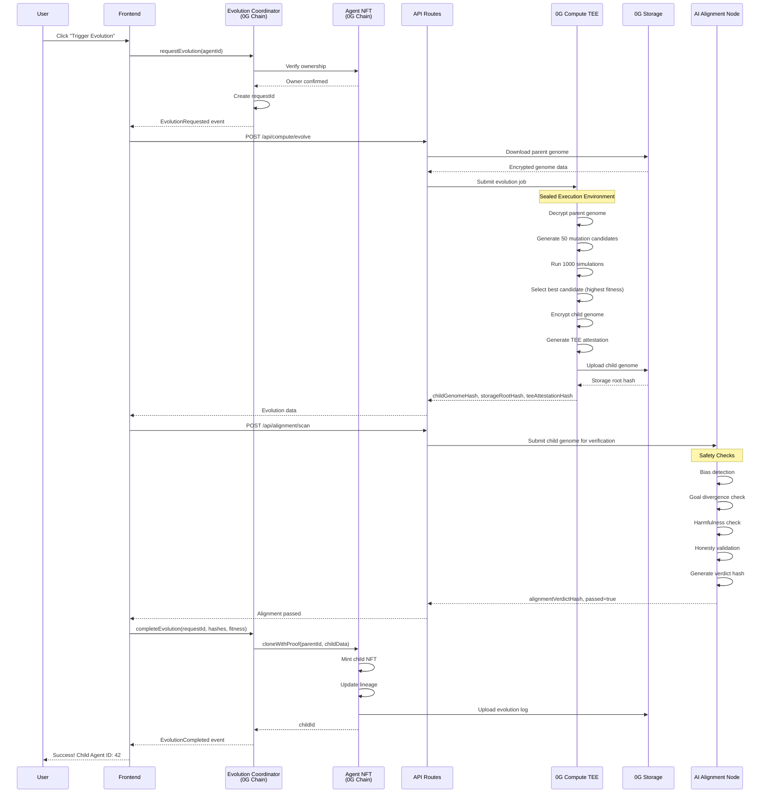
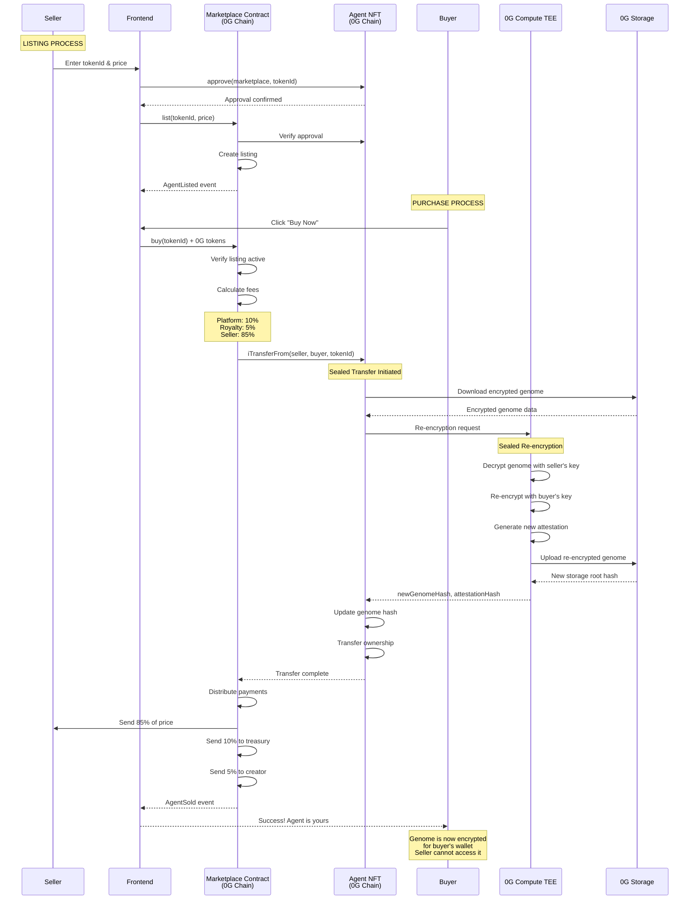
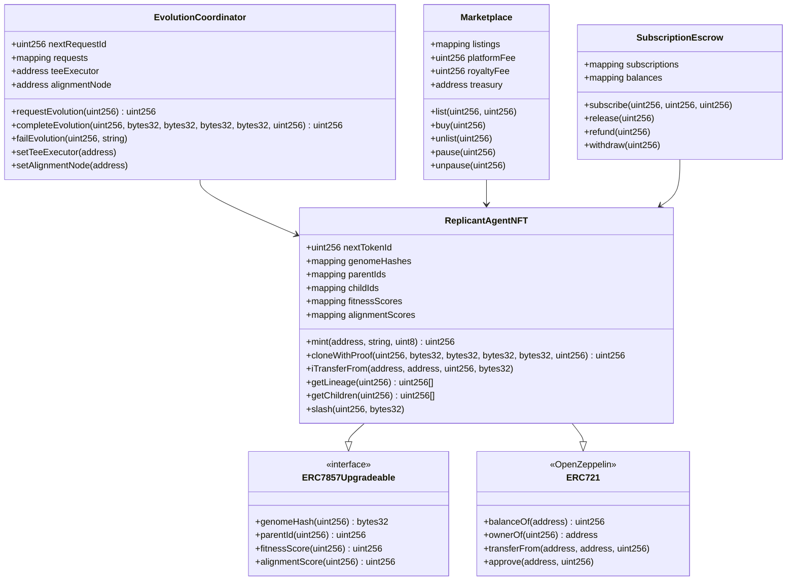

# 🏗️ REPLICANT Architecture - Mermaid Diagrams

## 1. Complete System Architecture (5 Layers)

```mermaid
graph TB
    subgraph "Layer 5: User Interface"
        UI[React Dashboard]
        Landing[Landing Page]
        Genesis[Genesis Minting]
        Evolution[Evolution Chamber]
        Marketplace[Marketplace]
        Tree[Family Tree]
        Terminal[Trading Terminal]
    end

    subgraph "Layer 4: Economics & Identity"
        AgentNFT[ReplicantAgentNFT<br/>ERC-7857 iNFT]
        EvolutionCoord[Evolution Coordinator]
        MarketContract[Marketplace Contract]
        Escrow[Subscription Escrow]
        Superfluid[Superfluid Streams]
    end

    subgraph "Layer 3: Memory & Data - 0G STORAGE"
        StorageLog[0G Storage Log<br/>Immutable Archive]
        StorageKV[0G Storage KV<br/>Real-Time Metrics]
        Genomes[Encrypted Genomes]
        EvolutionLogs[Evolution Logs]
        Attestations[TEE Attestations]
        Verdicts[Alignment Verdicts]
    end

    subgraph "Layer 2: Evolution Engine - 0G COMPUTE TEE"
        TEE[0G Compute TEE]
        Decrypt[Genome Decryption]
        Mutation[Mutation Algorithm]
        Simulation[Fitness Simulation]
        Reencrypt[Re-encryption]
    end

    subgraph "Layer 1: Safety & Alignment"
        AlignmentNode[AI Alignment Node]
        BiasCheck[Bias Detection]
        GoalCheck[Goal Divergence]
        HarmCheck[Harmfulness Check]
        HonestyCheck[Honesty Validation]
        Slashing[Slashing Mechanism]
    end

    UI --> AgentNFT
    UI --> EvolutionCoord
    UI --> MarketContract
    UI --> Escrow
    
    AgentNFT --> StorageLog
    EvolutionCoord --> TEE
    EvolutionCoord --> AlignmentNode
    
    TEE --> Decrypt
    TEE --> Mutation
    TEE --> Simulation
    TEE --> Reencrypt
    
    TEE --> StorageLog
    TEE --> Attestations
    
    AlignmentNode --> BiasCheck
    AlignmentNode --> GoalCheck
    AlignmentNode --> HarmCheck
    AlignmentNode --> HonestyCheck
    AlignmentNode --> Verdicts
    AlignmentNode --> Slashing
    
    MarketContract --> AgentNFT
    Escrow --> Superfluid
    
    StorageLog --> Genomes
    StorageLog --> EvolutionLogs
    StorageKV --> Terminal

    style StorageLog fill:#8b5cf6,stroke:#fff,color:#fff
    style StorageKV fill:#8b5cf6,stroke:#fff,color:#fff
    style TEE fill:#8b5cf6,stroke:#fff,color:#fff
    style AlignmentNode fill:#8b5cf6,stroke:#fff,color:#fff
```



---

## 2. 0G Integration Deep Dive



---

## 3. Evolution Flow with 0G Integration



---

## 4. Alpha Hunter Data Flow with External APIs

```mermaid
graph TB
    subgraph "Cron Trigger"
        Vercel[Vercel Cron<br/>Every Hour]
        CronAPI[/api/cron/alphahunter]
    end

    subgraph "Data Sources - External APIs"
        Binance[Binance API<br/>Real-time Prices]
        RSS[RSS Feeds<br/>CoinDesk, CoinTelegraph]
        Discord[Discord Bot<br/>Community Sentiment]
        Farcaster[Farcaster/Neynar<br/>Warpcast Casts]
        Lens[Lens Protocol<br/>Hey.xyz Posts]
        Etherscan[Etherscan API<br/>Whale Tracking]
        CoinGecko[CoinGecko API<br/>Market Data]
        FearGreed[Fear & Greed Index<br/>alternative.me]
    end

    subgraph "Signal Generation"
        SignalAPI[/api/alphahunter/signal]
        
        subgraph "Data Processing"
            PriceService[Price Service]
            NewsService[News Service]
            DiscordService[Discord Service]
            FarcasterService[Farcaster Service]
            LensService[Lens Service]
            WhaleService[Whale Tracker]
            MarketService[Market Data Service]
        end
        
        subgraph "Analysis Engine"
            SentimentCalc[Sentiment Calculation<br/>40% Weight]
            WhaleCalc[Whale Activity<br/>30% Weight]
            MarketCalc[Market Structure<br/>30% Weight]
            FinalScore[Final Score Calculation]
        end
        
        subgraph "LLM Analysis - Optional"
            OpenRouter[OpenRouter API]
            Claude[Claude 3.5 Sonnet]
            Fallback[Rule-Based Fallback]
        end
        
        subgraph "Signal Output"
            SignalType[BUY/HOLD/SELL]
            Confidence[Confidence Score]
            Reasoning[Detailed Reasoning]
            Prices[Entry/TP/SL Prices]
        end
    end

    subgraph "0G Integration"
        TEECommit[TEE Attestation Hash]
        StorageCommit[0G Storage Root Hash]
        StorageUpload[Upload to 0G Storage]
    end

    subgraph "Delivery"
        DiscordBroadcast[Discord Rich Embed]
        Dashboard[Dashboard Update]
        Database[In-Memory Store<br/>TODO: PostgreSQL]
    end

    Vercel --> CronAPI
    CronAPI --> SignalAPI
    
    SignalAPI --> PriceService
    SignalAPI --> NewsService
    SignalAPI --> DiscordService
    SignalAPI --> FarcasterService
    SignalAPI --> LensService
    SignalAPI --> WhaleService
    SignalAPI --> MarketService
    
    PriceService --> Binance
    NewsService --> RSS
    DiscordService --> Discord
    FarcasterService --> Farcaster
    LensService --> Lens
    WhaleService --> Etherscan
    MarketService --> CoinGecko
    MarketService --> FearGreed
    
    PriceService --> SentimentCalc
    NewsService --> SentimentCalc
    DiscordService --> SentimentCalc
    FarcasterService --> SentimentCalc
    LensService --> SentimentCalc
    
    WhaleService --> WhaleCalc
    MarketService --> MarketCalc
    
    SentimentCalc --> FinalScore
    WhaleCalc --> FinalScore
    MarketCalc --> FinalScore
    
    FinalScore --> OpenRouter
    OpenRouter --> Claude
    Claude --> SignalType
    FinalScore --> Fallback
    Fallback --> SignalType
    
    SignalType --> Confidence
    Confidence --> Reasoning
    Reasoning --> Prices
    
    Prices --> TEECommit
    TEECommit --> StorageCommit
    StorageCommit --> StorageUpload
    
    StorageUpload --> DiscordBroadcast
    StorageUpload --> Dashboard
    StorageUpload --> Database

    style Binance fill:#f59e0b,stroke:#fff,color:#000
    style RSS fill:#f59e0b,stroke:#fff,color:#000
    style Discord fill:#f59e0b,stroke:#fff,color:#000
    style Farcaster fill:#f59e0b,stroke:#fff,color:#000
    style Lens fill:#f59e0b,stroke:#fff,color:#000
    style Etherscan fill:#f59e0b,stroke:#fff,color:#000
    style CoinGecko fill:#f59e0b,stroke:#fff,color:#000
    style FearGreed fill:#f59e0b,stroke:#fff,color:#000
    style StorageUpload fill:#8b5cf6,stroke:#fff,color:#fff
    style TEECommit fill:#8b5cf6,stroke:#fff,color:#fff
    style StorageCommit fill:#8b5cf6,stroke:#fff,color:#fff
```

---

## 5. Marketplace Flow with Sealed Handover



---

## 6. Smart Contract Architecture



---

## 7. Frontend Architecture

```mermaid
graph TB
    subgraph "Next.js 15 App Router"
        App[app/layout.tsx]
        Providers[app/providers.tsx]
        
        subgraph "Pages"
            Landing[app/page.tsx]
            Dashboard[app/dashboard/page.tsx]
            Genesis[app/dashboard/genesis/page.tsx]
            Evolution[app/dashboard/evolution/page.tsx]
            Marketplace[app/dashboard/marketplace/page.tsx]
            Tree[app/dashboard/tree/page.tsx]
            AgentDetail[app/dashboard/agents/[id]/page.tsx]
        end
        
        subgraph "API Routes"
            StorageAPI[app/api/storage/*]
            ComputeAPI[app/api/compute/*]
            AlignmentAPI[app/api/alignment/*]
            AlphaHunterAPI[app/api/alphahunter/*]
            CronAPI[app/api/cron/*]
            MetadataAPI[app/api/metadata/*]
        end
    end

    subgraph "Components"
        subgraph "Landing"
            Hero[Hero.tsx]
            Features[HowItWorks.tsx]
            SpeciesGrid[SpeciesGrid.tsx]
        end
        
        subgraph "Dashboard"
            Sidebar[DashboardSidebar.tsx]
            Stats[StatsCards.tsx]
            Activity[ActivityFeed.tsx]
        end
        
        subgraph "Genesis"
            MintForm[GenesisMintForm.tsx]
        end
        
        subgraph "Evolution"
            EvolutionCard[EvolutionCard.tsx]
            MutationLog[MutationLog.tsx]
            EvolutionHistory[EvolutionHistory.tsx]
        end
        
        subgraph "Marketplace"
            MarketGrid[MarketplaceGrid.tsx]
            AgentCard[AgentCard.tsx]
            DetailModal[AgentDetailModal.tsx]
            ListingForm[ListingForm.tsx]
        end
        
        subgraph "Alpha Hunter"
            Terminal[AlphaHunterTerminal.tsx]
            Feed[AlphaHunterFeed.tsx]
        end
        
        subgraph "Shared"
            WalletButton[WalletButton.tsx]
            NetworkGuard[NetworkGuard.tsx]
            INFTBadge[INFTBadge.tsx]
            ExplorerLink[ExplorerLink.tsx]
        end
    end

    subgraph "State Management"
        Zustand[Zustand Store]
        WalletState[Wallet State]
        AgentState[Active Agent State]
        ChainState[Chain Status State]
    end

    subgraph "Web3 Integration"
        Wagmi[wagmi v2]
        Viem[viem]
        WalletConnect[WalletConnect]
        Contracts[Contract ABIs]
    end

    subgraph "External Services"
        Binance[Binance API]
        Discord[Discord Bot]
        Farcaster[Farcaster API]
        Lens[Lens Protocol]
        Etherscan[Etherscan API]
    end

    App --> Providers
    Providers --> Landing
    Providers --> Dashboard
    
    Dashboard --> Genesis
    Dashboard --> Evolution
    Dashboard --> Marketplace
    Dashboard --> Tree
    Dashboard --> AgentDetail
    
    Genesis --> MintForm
    Evolution --> EvolutionCard
    Evolution --> MutationLog
    Evolution --> EvolutionHistory
    Marketplace --> MarketGrid
    Marketplace --> AgentCard
    Marketplace --> DetailModal
    AgentDetail --> Terminal
    
    MintForm --> Wagmi
    EvolutionCard --> Wagmi
    MarketGrid --> Wagmi
    
    Wagmi --> Viem
    Wagmi --> WalletConnect
    Wagmi --> Contracts
    
    Providers --> Zustand
    Zustand --> WalletState
    Zustand --> AgentState
    Zustand --> ChainState
    
    AlphaHunterAPI --> Binance
    AlphaHunterAPI --> Discord
    AlphaHunterAPI --> Farcaster
    AlphaHunterAPI --> Lens
    AlphaHunterAPI --> Etherscan
    
    ComputeAPI --> TEE[0G Compute TEE]
    StorageAPI --> Storage[0G Storage]
    AlignmentAPI --> Alignment[AI Alignment Node]

    style TEE fill:#8b5cf6,stroke:#fff,color:#fff
    style Storage fill:#8b5cf6,stroke:#fff,color:#fff
    style Alignment fill:#8b5cf6,stroke:#fff,color:#fff
```

